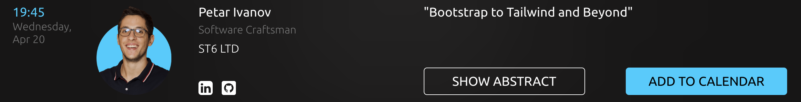

# React Global Online Summit 2022 (Junior Track)

- Video is [here](https://www.youtube.com/watch?v=u4QTr56t7iM&t=24633s&ab_channel=GeekleOfficial).

- Slides are [here](https://docs.google.com/presentation/d/1_HCLbWqEDGk4_maeQ7KwwnuSQZ3-v0vVbqn0TRQeLh8/edit).

# Bootstrap to Tailwind and Beyond

How did we migrate from Angular to React & Bootstrap and then from Bootstrap to Tailwind?

We will go step by step to the migration journey we went through with one of our clients regarding their customer-facing web application.

We will go through:

- our migration strategy and the why behind it;
- some of the failures we had and the lessons we have learned from them;
- some anti-patterns and some good practices from our own experience and point of view
