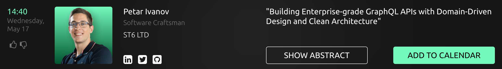

# Worldwide Software Architecture Summit 2023 (Pro Track)

- Video is [here](https://drive.google.com/file/d/1WDOUpwRuKl0X4Fw-j5H3y2_HshNWXt8j/view).

- Slides are [here](https://petarivanov.me/building-robust-graphql-api-with-typeScript-ddd-and-clean-architecture-wsas-2023.pdf).

- Code repo & examples are [here](https://github.com/petarivanovv9/graphql-api-ts-ddd-clean-architecture).

# Building Enterprise-grade GraphQL APIs with Domain-Driven Design and Clean Architecture

In this talk, we will explore how to build scalable and maintainable GraphQL APIs for enterprise applications using Domain-Driven Design and Clean Architecture patterns.

We will discuss the importance of modularizing your API around the business domain and better subdomain organization as resonating with our architectural quality attributes.

We will go through the problems we are trying to solve with this architecture, such as handling complex business domains and achieving maintainability and scalability.

We will cover the key components of a GraphQL API, including resolvers, domain layer, and database layer.

Finally, we will demonstrate how to write effective tests to ensure the quality of your GraphQL API.
