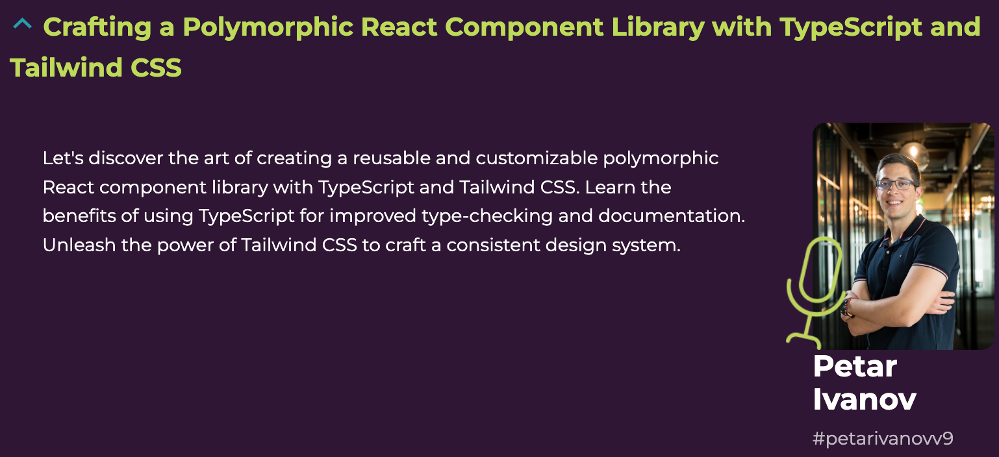

# Crafting a Polymorphic React Component Library with TypeScript and Tailwind CSS, meet.js summit '23

- Link to the event [here](https://summit.meetjs.pl/2023/).

- Slides are [here](https://docs.google.com/presentation/d/1sItzKzqUibzdlCiew_OnDLxFjQs_jBq0LTAHmeQ3Wko/edit#slide=id.p).

- Code repo & examples are [here](https://github.com/petarivanovv9/polymorphic-react-component-library).

# Crafting a Polymorphic React Component Library with TypeScript and Tailwind CSS

Let's discover the art of creating a reusable and customizable polymorphic React component library with TypeScript and Tailwind CSS.

Learn the benefits of using TypeScript for improved type-checking and documentation.

Unleash the power of Tailwind CSS to craft a consistent design system.
